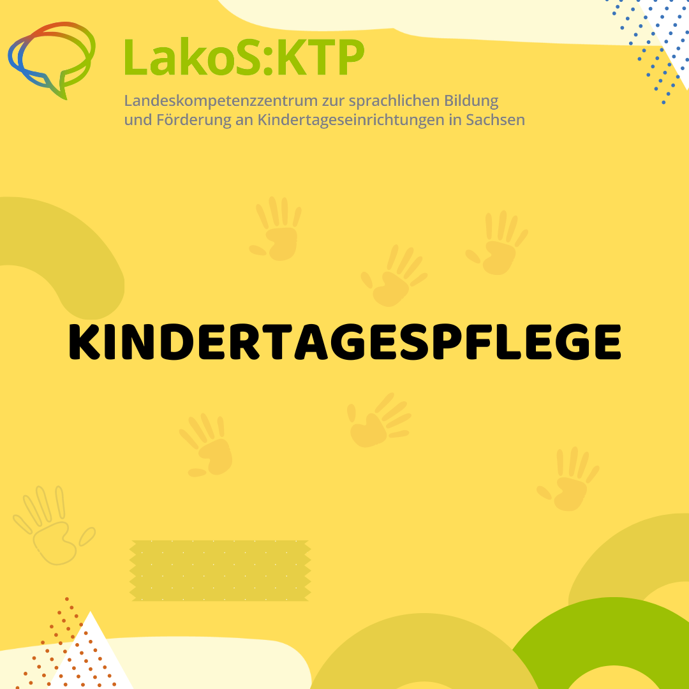
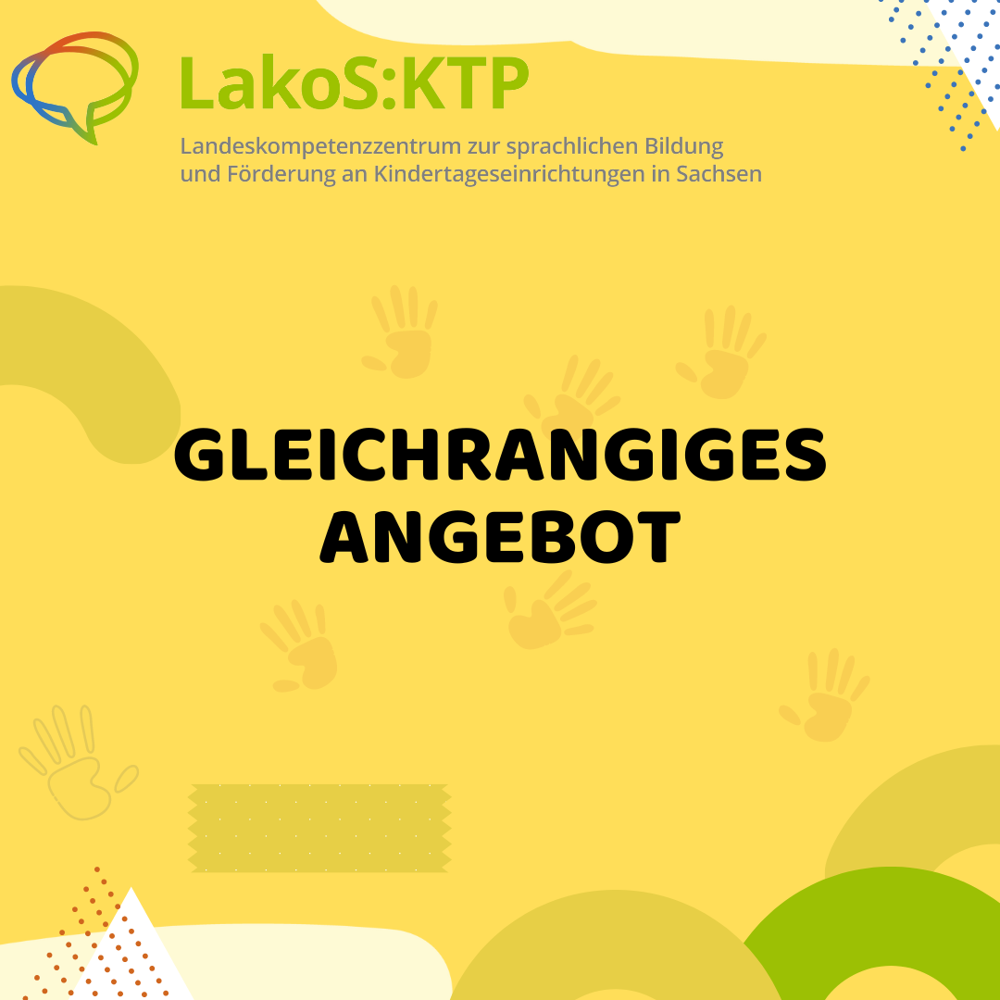

# Content

## Kindertagespflege

Kindertagespflege (KTP) ist eine familiennahe Betreuungsform für Kinder.

## Kindertagespflegeperson

Kindertagespflegeperson (KTPP) ist die Berufsbezeichnung für Menschen, die in der KTP arbeiten. Manche Menschen sagen auch noch Tagesmutter oder Tagesvater.

## 5570 Kinder

Aktuell (Stand 2023) werden 5570 Kinder in einer Kindertagespflege in Sachsen betreut.

## 1302 Kindertagespflegepersonen

Aktuell (Stand 2023) arbeiten in Sachsen 1302 Kindertagespflegepersonen.

## 0 - 3 Jahre

In einer Kindertagespflege werden primär Kinder im Alter von 0-3 Jahren betreut.

## 5 Kinder

In Sachsen werden maximal fünf Kinder von einer Kindertagespflegeperson betreut.

## Großtagespflege

In anderen Bundesländern gibt es auch das Konzept der Großtagespflege, hier können bis zu zehn Kinder von zwei Kindertagespflegepersonen betreut werden.

## IKS Sachsen

Die Informations- und Koordinierungsstelle Kindertagespflege in Sachsen (IKS) ist für die Begleitung und Unterstützung der Kindertagespflege in Sachsen zuständig.

## BVKTP

Der Bundesverband für Kindertagespflege e. V. ist der Fachverband für die Kindertagespflege in Deutschland.

## 50 Jahre

In Deutschland gibt es seit 50 Jahren Kindertagespflege.In Sachsen wurde 2017 "25 Jahre Kindertagespflege in Sachsen" gefeiert.

## Qualifizierung der Kindertagespflegeperson

KTPP benötigen eine Bescheinigung über ein absolviertes Curriculum, eine Eignung, eine Erlaubnis und eine individuelle Konzeption, um als KTPP arbeiten zu dürfen.

## DJI & QHB Curriculum

Das Curriculum des Deutschen Jugend Instituts (DJI) mit 160UE ist Mindestqualifizierungsstand in allen Bundesländern. Zunehmend geben die Bundesländer auch das QHB (Qualifizierungshandbuch für die Kindertagespflege) mit 300 UE vor. Das QHB knüpft an das DJI-Curriculum an.

## Betreuungsort

Die Kinder werden entweder im Haushalt der KTPP, im Haushalt der Erziehungsberechtigten oder in anderen geeigneten Räumen betreut. In Sachsen werden die meisten Kinder in anderen geeigneten Räumen betreut.

## Selbstständig

Eine KTPP arbeitet in der Regel selbstständig.

## Gesetzliche Grundlagen

Für die KTP gelten gesetzliche Grundlagen (die gleichen wie in Kindertageseinrichtungen). Dazu gehören u. a. das Sächsische Gesetz zur Förderung von Kindern in Tageseinrichtungen (SächsKitaG) und der Sächsische Bildungsplan.

## eine Bezugsperson

KTPP bilden eine feste Bezugsperson für die Kinder und eine klare Ansprechperson für die Familien.

## Fachberatung

Eine Kindertagespflegeperson wird immer von einer Fachberatung begleitet.

## Gleichrangiges Angebot

Die Kindertagespflege kann als gleichrangiges Angebot neben der institutionellen Betreuung in Krippe und Kindergarten bezeichnet werden.

## 29.05.2024

Am 29.05.2024 findet der Aktionstag „Kindertagespflege? Selbstverständlich!“ unter dem Motto: „Kindertagespflege ist so selbstverständlich wie das Scheinen der Sonne.“ statt.

## U3

Im Alter von 0-3 Jahren werden wichtige Grundsteine für die Sprachentwicklung gelegt.

## Weiterbildung

Kindertagespflegepersonen besuchen regelmäßig Fort- und Weiterbildungen.

## Platz für viele Worte

Je kleiner die Gruppe, desto mehr Möglichkeiten haben die Kinder, zu Wort zu kommen und ihre sprachlichen Fähigkeiten zu erproben.

## Sprachanregende Aktivitäten in der KTP

Kindertagespflegestellen sind Orte, an denen täglich sprachanregende Aktivitäten, wie beispielsweise dialogische Bilderbuchbetrachtungen, Durchführung von Aktionstabletts oder Geschichtensäckchen stattfinden können.

## LakoS KTP

Seit dem 01.10.2023 gibt es im LakoS den Arbeitsschwerpunkt Kindertagespflege.
